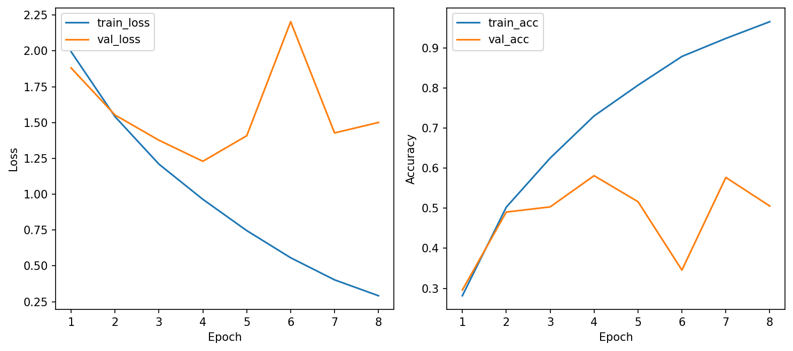
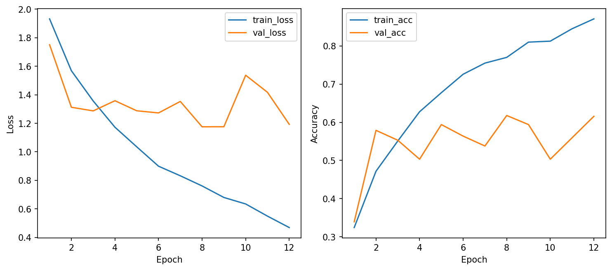
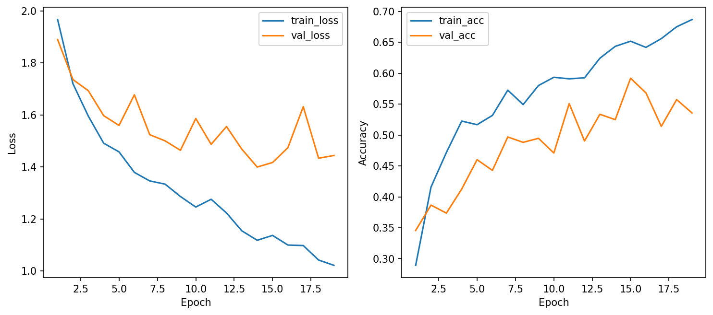
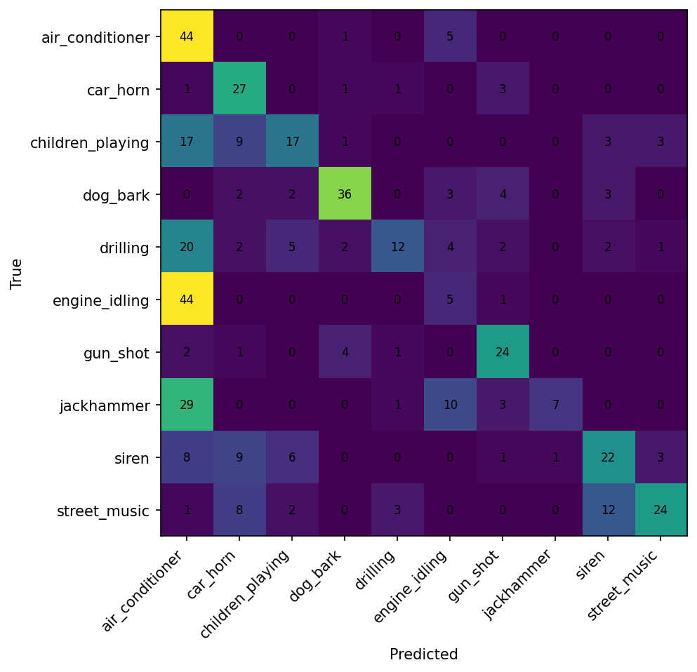
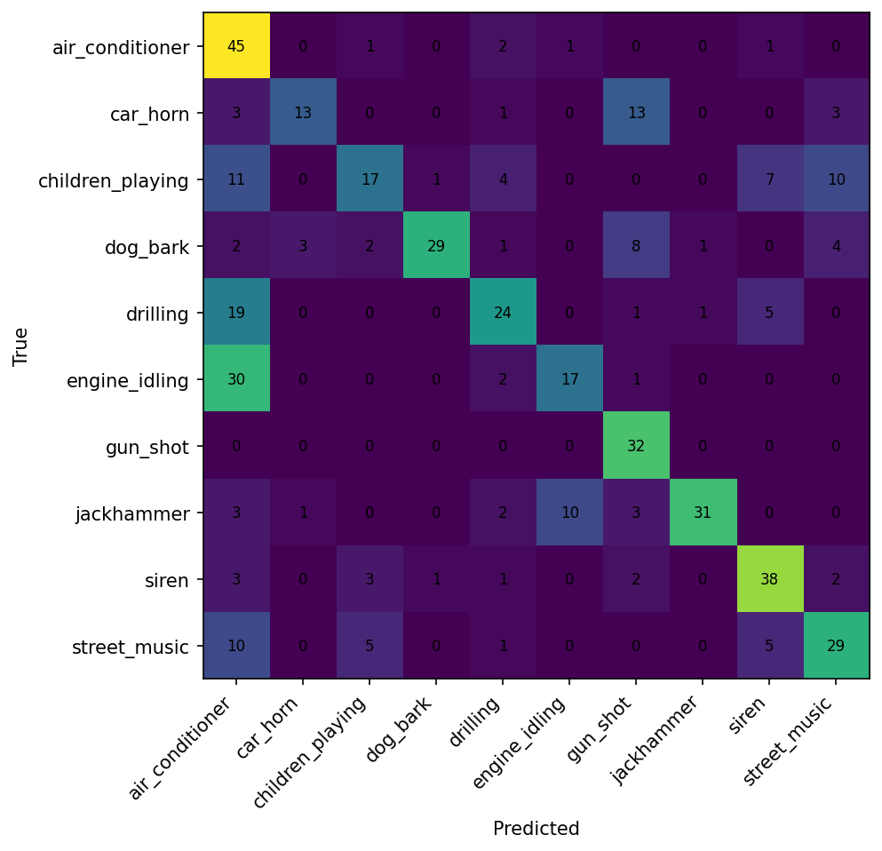
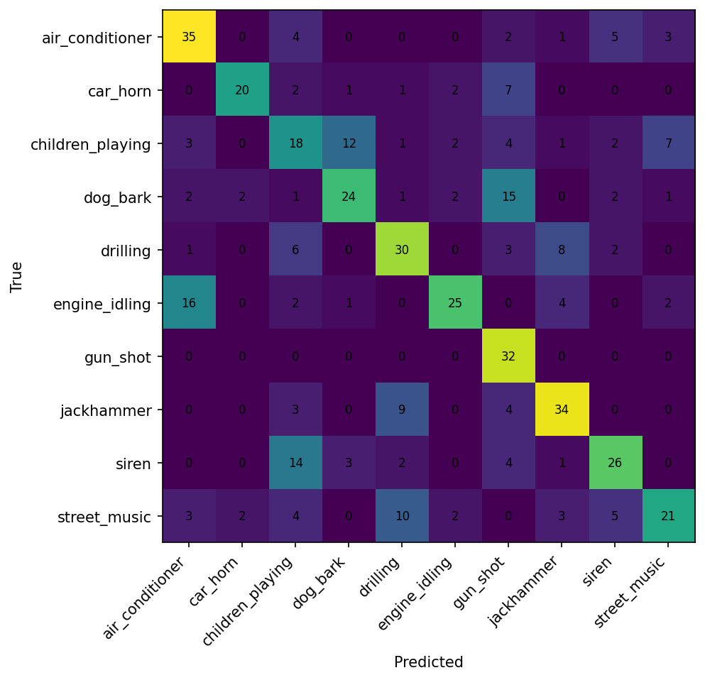

# CSC4005 Lab 3 Report - UrbanSound8K with 1D-CNN

## 1. Thông tin sinh viên

- Họ tên: Lưu Thanh Tùng
- Mã sinh viên: 1771040029
- Lớp: KHMT-1701
- Link GitHub repo: https://github.com/FIT-DNU-CS-16-01/fit-dnu-cs-16-01-17-01-csc4005-csc4005_lab3_1dcnn-csc4005_lab3_urbansound8k_1dcnn_starter_kit
- Link W&B project: https://wandb.ai/thanhtung-contact-official-/csc4005-lab3-urbansound-1dcnn
- Link W&B run mới nhất (e30):
  - Fast debug e30: https://wandb.ai/thanhtung-contact-official-/csc4005-lab3-urbansound-1dcnn/runs/dx0k7zt7
  - Baseline MFCC e30: https://wandb.ai/thanhtung-contact-official-/csc4005-lab3-urbansound-1dcnn/runs/yk6rb6l1
  - Log-mel e30: https://wandb.ai/thanhtung-contact-official-/csc4005-lab3-urbansound-1dcnn/runs/fqhalgyo
  - Raw waveform e30: https://wandb.ai/thanhtung-contact-official-/csc4005-lab3-urbansound-1dcnn/runs/ao2oo2tn

---

## 2. Mục tiêu thí nghiệm

- Phân loại âm thanh môi trường trên UrbanSound8K.
- Dùng MFCC/log-mel làm chuỗi đặc trưng theo thời gian.
- Xây dựng và huấn luyện mô hình 1D-CNN.
- Theo dõi thí nghiệm bằng W&B.
- Phân tích learning curves và confusion matrix.

Báo cáo này dùng dữ liệu chạy mới nhất với thiết lập `epochs = 30` cho các cấu hình. Số epoch thực tế có thể nhỏ hơn do early stopping.

---

## 3. Dữ liệu và tiền xử lý

### 3.1 Dataset

- Dataset: UrbanSound8K
- Số lớp: 10
- Các lớp: air_conditioner, car_horn, children_playing, dog_bark, drilling, engine_idling, gun_shot, jackhammer, siren, street_music
- Fold train: 1-8
- Fold validation: 9
- Fold test: 10

### 3.2 Cấu hình tiền xử lý

| Thành phần | Giá trị |
|---|---|
| Sample rate | 16000 |
| Duration | 4.0 giây |
| n_fft | 1024 |
| hop_length | 512 |
| n_mfcc | 40 |
| n_mels | 64 |
| Augmentation | Bật cho train set (`augment=true`) |

Giải thích ngắn:

- Cần thống nhất sample rate để các clip có cùng thang thời gian-tần số.
- Cần pad/crop về cùng độ dài để tensor đầu vào đồng nhất cho DataLoader và Conv1D.

---

## 4. Mô hình 1D-CNN và cấu hình train

Kiến trúc tổng quát:

```text
Input feature sequence
-> Conv1D block 1
-> Conv1D block 2
-> Conv1D block 3
-> Global Average Pooling
-> Dense classifier
-> Softmax
```

Bảng cấu hình:

| Thành phần | Baseline MFCC / Log-mel | Raw waveform |
|---|---|---|
| model_name | mfcc_1dcnn / logmel_1dcnn | raw_1dcnn |
| hidden_channels | [64, 128, 128] | [32, 64, 128] |
| dropout | 0.35 | 0.40 |
| optimizer | AdamW | AdamW |
| learning rate | 0.001 | 0.0005 |
| weight_decay | 0.0001 | 0.0001 |
| batch_size | 32 | 16 |
| epochs (yêu cầu) | 30 | 30 |
| patience | 4 | 5 |

---

## 5. Kết quả thực nghiệm (đã cập nhật theo run e30)

### 5.1 Kết quả tổng hợp

| Run | Feature | Epoch yêu cầu | Epoch thực tế | Best val acc | Test acc | Avg epoch time (s) | Tổng tham số |
|---|---|---:|---:|---:|---:|---:|---:|
| 1771040029_debug_mfcc_1dcnn_e30 | MFCC (debug) | 30 | 8 | 0.4267 | 0.3933 | 0.5349 | 78,490 |
| 1771040029_mfcc_1dcnn_baseline_e30 | MFCC | 30 | 8 | 0.5810 | 0.4688 | 1.7950 | 137,930 |
| 1771040029_logmel_1dcnn_e30 | Log-mel | 30 | 12 | 0.6177 | 0.5914 | 2.1733 | 145,610 |
| 1771040029_raw_waveform_extension_e30 | Raw waveform | 30 | 19 | 0.5248 | 0.5699 | 6.9136 | 129,450 |

Nhận xét nhanh:

- Run tốt nhất theo validation và test là `1771040029_logmel_1dcnn_e30`.
- Raw waveform có thời gian train/epoch cao hơn đáng kể.
- Tăng `epochs` lên 30 không đồng nghĩa chạy đủ 30 epoch vì cơ chế early stopping.

### 5.2 Learning curves

Baseline MFCC e30:



Log-mel e30:



Raw waveform e30:



Nhận xét:

- Baseline MFCC có dấu hiệu overfitting từ khoảng epoch 4-5 (train acc tăng mạnh, val loss dao động).
- Log-mel ổn định hơn trên validation và cho kết quả tổng thể tốt nhất.
- Raw waveform học chậm hơn, cần nhiều thời gian train hơn để cải thiện.

### 5.3 Confusion matrix

Baseline MFCC e30:



Log-mel e30:



Raw waveform e30:



Nhận xét nổi bật (baseline MFCC e30):

- Các nhầm lẫn lớn: `engine_idling -> air_conditioner`, `jackhammer -> air_conditioner`, `drilling -> air_conditioner`.
- Nguyên nhân khả dĩ: các lớp âm thanh đô thị có nền nhiễu và đặc trưng phổ gần nhau.

---

## 6. W&B tracking

Yêu cầu dashboard đã có đủ:

- learning curves,
- final metrics,
- cấu hình chạy,
- ảnh confusion matrix.

Danh sách run e30 đã log đầy đủ:

- 1771040029_debug_mfcc_1dcnn_e30
- 1771040029_mfcc_1dcnn_baseline_e30
- 1771040029_logmel_1dcnn_e30
- 1771040029_raw_waveform_extension_e30

---

## 7. Phân tích và thảo luận

1. Vì sao dùng 1D-CNN thay vì MLP?
- 1D-CNN tận dụng tính cục bộ theo thời gian của chuỗi đặc trưng, học các mẫu ngắn tốt hơn MLP.

2. Kernel 1D trượt theo chiều nào?
- Trượt theo trục thời gian (`time_frames` với MFCC/log-mel, `samples` với raw waveform).

3. MFCC giúp gì so với raw waveform?
- MFCC giảm số chiều và tóm tắt thông tin phổ quan trọng, giúp tối ưu dễ hơn trong điều kiện tài nguyên giới hạn.

4. Hạn chế hiện tại?
- Baseline MFCC bị overfitting sớm.
- Một số cặp lớp vẫn dễ nhầm do đặc trưng âm thanh gần nhau.

5. Hướng cải thiện?
- Tune học sâu hơn: learning rate, weight decay, dropout, patience.
- Chạy nhiều seed để đánh giá độ ổn định.
- Tăng cường augmentation và cân bằng dữ liệu.

---

## 8. Bài mở rộng

| Pipeline | Feature/Input | Test accuracy | Nhận xét |
|---|---|---:|---|
| Baseline | MFCC + 1D-CNN | 0.4688 | Ổn định nhưng overfitting sớm. |
| Extension 1 | Log-mel + 1D-CNN | 0.5914 | Tốt nhất trong các run e30. |
| Extension 2 | Raw waveform + 1D-CNN | 0.5699 | Kết quả khá tốt nhưng train tốn thời gian hơn. |

---

## 9. Kết luận

1. Pipeline chuẩn hóa audio (sample rate, duration) là bắt buộc để mô hình học ổn định.
2. 1D-CNN phù hợp với dữ liệu chuỗi theo thời gian trong bài toán âm thanh.
3. Ở bộ chạy mới nhất e30, log-mel + 1D-CNN cho kết quả tốt nhất theo cả validation và test.
4. Raw waveform vẫn có tiềm năng nhưng cần thêm tài nguyên và tinh chỉnh.
5. W&B và confusion matrix rất quan trọng để đánh giá mô hình dựa trên số liệu thực nghiệm.
